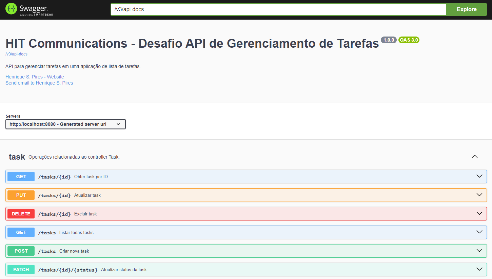

# Desafio HIT Communications TODO List - API de Gerenciamento de Tarefas

## 1. Descrição
- Este projeto consiste em uma API RESTful para gerenciamento de tarefas (TODO list), desenvolvida com Spring Boot, utilizando Spring Data JPA para acesso ao banco de dados com validação de dados. A API permite operações CRUD básicas para tarefas, incluindo criação, leitura, atualização e remoção de tarefas. Além disso, há suporte para atualização de status das tarefas e paginação na listagem. A API também utiliza o Spring Boot Actuator para monitoramento de métricas customizadas.

## 2. Tecnologias Utilizadas
- Spring Boot: Framework para criação de aplicativos Java baseados em padrões.
- Spring Data JPA: Facilita a implementação de repositórios baseados em JPA.
- Jakarta Validation: Para validação de dados.
- H2 Database: Banco de dados em memória para testes.
- MySQL: Banco de dados relacional para persistência de dados.
- Docker Compose: Para configurar o ambiente de desenvolvimento com MySQL.
- Lombok: Biblioteca Java que auxilia na redução de código boilerplate.
- Jakarta Persistence (JPA): Especificação para persistência de dados em Java.
- JUnit 5: Framework de teste para Java.
- Maven: Gerenciador de dependências.
- Spring Boot Actuator: Para monitoramento e métricas da aplicação.

## 3. Funcionalidades:
### Listagem de Tarefas

#### Endpoint: GET /tasks?page=0&size=10
- Descrição: Retorna uma lista paginada de todas as tarefas cadastradas.

### Buscar Tarefa por ID
#### Endpoint: GET /tasks/{id}
- Descrição: Retorna uma tarefa específica com base no ID fornecido.

### Adicionar Tarefa
#### Endpoint: POST /tasks
- Descrição: Cria uma nova tarefa com os dados fornecidos.

### Atualizar Tarefa
#### Endpoint: PUT /tasks/{id}
- Descrição: Atualiza uma tarefa existente com base no ID fornecido.

### Atualizar Status da Tarefa
#### Endpoint: PATCH /tasks/{id}/{status}
- Descrição: Atualiza o status de uma tarefa existente com base no ID fornecido.
- É necessário checar se está de acordo com o TaskStatus enum para atualizar o status corretamente.

### Deletar Tarefa
#### Endpoint: DELETE /tasks/{id}
- Descrição: Deleta uma tarefa existente com base no ID fornecido.

## 4. Monitoramento de tarefas
### Endpoint Customizado: GET /actuator/taskMetrics
#### Descrição: Retorna métricas customizadas sobre as tarefas, incluindo:
- Total de tarefas
- Tarefas concluídas
- Tarefas pendentes
- Tarefas em andamento
- Tarefas de alta prioridade
- Tarefas criadas no último mês
- Tempo médio para concluir uma tarefa

Para acessar, inicie a aplicação e use a url: "<a> http://localhost:8081/actuator/taskMetrics </a>".

## 5. Testes implementados
- A API possui uma cobertura de testes que inclui:
- Testes unitários: TaskServiceTask, TaskTest, TaskRepositoryTest e TaskController
- Testes integrado: TaskServiceIT

- Importante ressaltar que os testes da classe TaskController só estão funcionando normalmente quando o CommandLineRunner da classe principal (HitTodolistApplication) está comentado. 

## 6. Como executar o programa
- Clone ou baixe o repositório  na sua máquina

### Docker (recomendado)
- Caso deseje executar o programa com o Docker, vá para o diretório raiz
- No diretório raiz do projeto, execute o Docker Compose para configurar o MySQL e o container da aplicação: `docker compose up`
- Tome um café ☕ e aguarde alguns instantes enquanto a aplicação se inicia.

### Execução por build
- Certifique-se de ter o Java JDK 17 ou superior instalado.
- Você precisará de um ambiente de desenvolvimento configurado com o Maven e um IDE de sua preferência (como IntelliJ IDEA, Eclipse, etc.).
- O Docker e Docker Compose são necessários para executar o banco de dados MySQL.
- Execute o comando para instanciar o container do MySQL `docker compose up -d mysql`
- Execute a build do programa sem os testes `mvn clean install -DskipTests`
- Execute a aplicação: `java -jar target/hit-todolist-0.0.1-SNAPSHOT.jar`

## 7. Documentação Swagger
- Para um melhor entendimento do projeto, a aplicação possui um documento Swagger que vai ajudá-lo a entender melhor sobre as estruturas dos controles e payloads. 

    

- Certifique-se de que a aplicação já está rodando antes e vá para o link: <a> "http://localhost:8080/swagger-ui/index.html#/" </a>
 
- Feito! Agora você pode usufruir das controladoras usadas na aplicação.